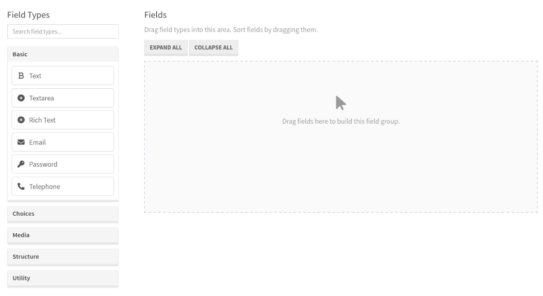
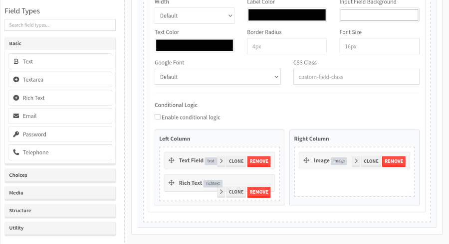
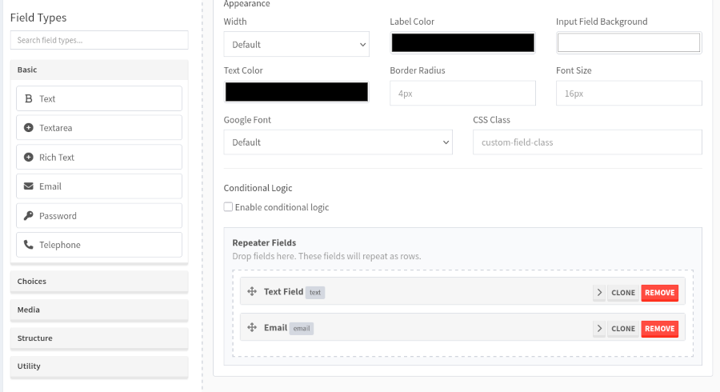
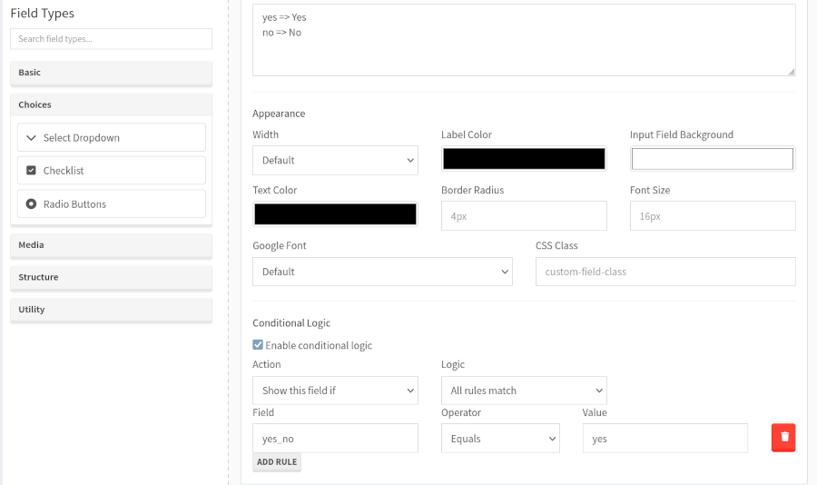

# Devflow Custom Fields

A powerful and flexible developer-friendly custom fields plugin for Devflow CMF.

Devflow Custom Fields allows developers to build advanced content editing experiences using repeaters, 
flexible content layouts, conditional logic, media fields, appearance controls, and more.

> __Requires__ Devflow Version: 2.x

> __Tested Up To:__ 2.0.0

> __Requires PHP:__ 8.4+

> __Stable Tag:__ 1.0.1

> __License:__ GPLv2-only

---

# Features

## Field Types

- Text
- Textarea
- Rich Text (TinyMCE)
- Select
- Checkbox
- Radio
- Image
- Gallery
- oEmbed
- Help/Instruction Fields

---

## Advanced Layout Features

- Repeaters
- Flexible Content Layouts
- 2 Column Containers
- 3 Column Containers
- Nested Layouts
- Nested Flexible Content

---

## Conditional Logic

Show or hide fields dynamically based on values from other fields.

Supports:
- show/hide rules
- all/any logic
- nested field support

---

## Media Features

- Drag and drop image upload
- Gallery ordering
- Image preview modal
- Video/media embedding support

---

## Appearance Controls

Per-field appearance settings:

- Width
- Label Color
- Input Field Background Color
- Text Color
- Border Radius
- Font Size
- Google Fonts
- CSS Class

---

## Accessibility

- aria labels
- screen reader announcements
- keyboard navigation
- focus restoration
- accessible media controls
- accessible validation errors

---

## Usage

```php
Field::get('field_name', $id); // default context is `content`
Field::get('field_name', $id, 'product');
Field::get('field_name', $id, 'user');

Field::gallery('field_name', $id);

Field::images('field_name', $id); // the field must be an array

Field::rows('field_name', $id); // the field must be an array

Field::raw('field_name', $id); // must be top level attribute key
```

---

# Screenshots

## Field Builder



---

## Flexible Content



---

## Repeater Fields

Repeaters save as arrays.

Example:

```php
[
    [
        'title' => 'Row 1',
        'description' => 'Example',
    ],
    [
        'title' => 'Row 2',
        'description' => 'Example',
    ]
]
```



---

## Conditional Logic



---

## Composer Installation

1. Start a new shell session.
2. Navigate to the root of your install, run the following command ```composer require getdevflow/custom-fields```.

---

# Location Rules

Field groups can be assigned to:

- Content
- Products
- Users

---

# Flexible Content Structure

Flexible content stores layout metadata.

Example:

```php
[
    [
        '_layout' => 'hero',
        '_uuid' => 'uuid',
        'heading' => 'Welcome',
        'content' => 'Example',
    ],
    [
        '_layout' => 'gallery',
        '_uuid' => 'uuid',
        'images' => [],
    ]
]
```

---

# Image Field Structure

Image fields save JSON arrays.

Example:

```php
[
    'url' => 'https://example.com/uploads/image.jpg',
    'name' => 'image.jpg',
    'mime' => 'image/jpeg',
]
```

---

# Gallery Field Structure

Gallery fields save arrays of image objects.

Example:

```php
[
    [
        'url' => 'https://example.com/uploads/image1.jpg',
    ],
    [
        'url' => 'https://example.com/uploads/image2.jpg',
    ]
]
```

---

# Conditional Logic

Conditional logic is configured per field.

Supports:

- equals
- not equals
- contains
- empty
- not empty

Example:

```text
Show field if:
"layout" equals "hero"
```

---

# Appearance Settings

Appearance settings are stored in:

```php
style_settings
```

Example:

```php
[
    'width' => '50',
    'label_color' => '#333333',
    'input_background' => '#ffffff',
    'text_color' => '#111111',
    'border_radius' => '6px',
    'font_size' => '16px',
    'google_font' => 'Inter',
]
```

---

# Google Fonts

Google Fonts can be selected from the Appearance section.

Fonts automatically load on render.

---

# Importing Field Groups

Navigate to:

```text
Custom Fields > Import
```

Upload:
- single field group export
- bundle export

Supported schema versions:

```text
devflow-custom-fields.v1
devflow-custom-fields.bundle.v1
```

---

# Exporting Field Groups

Field groups can be exported individually or in bulk.

Exports are JSON files.

---

# Cloning Field Groups

Use the Clone action from the field group table.

Cloning duplicates:
- fields
- layouts
- validation
- appearance settings
- conditional logic

---

# Developer Notes

## Recommended Usage

- Use flexible content for page builders
- Use repeaters for collections
- Use layouts for structured content
- Use conditional logic to simplify interfaces

---

## Performance Notes

Very large nested flexible content structures may impact browser performance.

Recommended:
- collapse unused sections
- split large groups
- avoid deeply nested repeaters where possible

---

# Roadmap

Future improvements may include:

- [ ] field tabs/groups
- [ ] advanced display settings
- [ ] reusable field presets
- [ ] field templates
- [ ] live previews
